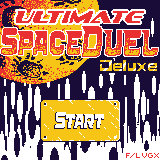

# Ultimated Space Duel Deluxe



A 2 player game written in C in 24h for the [WASM-4](https://wasm4.org) fantasy console.

## Controls

- ← and → to move (player 2: S and F)
- x to shoot bullets (p2: Q (azerty: A))
- w to charge and fire laser, when available (p2: Tab)

## Netplay

1. Press Return
2. "Copy netplay URL"
3. Player 2 just visit the link.

## Building

Build the cart by running:

```shell
make
```

Then run it with:

```shell
w4 run build/cart.wasm
```

## Made by

Code: lvgx. Graphics, sound : flx.
